# 📊 Operational Scorecard: Urban Threads Apparel

**Deployment:** Direct Shadow DOM Embed Widget + WooCommerce Integration + Exit-Intent Campaigns  
**Industry:** Direct-to-Consumer (DTC) Fashion & Apparel  
**Evaluation Window:** 30-Day Production Telemetry  
**Auditor:** Chatty Operational Assurance Framework v1.0  

---

## 🏆 Overall Evaluation

| Overall Grade | Composite Score | Operational Status | Benchmark Comparison |
|:---:|:---:|:---:|:---:|
| **A-** | **89.1 / 100** | **High Performing** | Top 8% of retail conversational deployments |

---

## 📊 5-Pillar Scorecard Breakdown

| Operational Pillar | Weight | Score | Status | Key Telemetry Metrics |
|---|:---:|:---:|:---:|---|
| **🎯 Conversion & Revenue Intent** | 25% | **88.4%** | Excellent | • 4,820 total visitor sessions<br>• 896 verified leads captured (18.6% conversion)<br>• $42,600 pipeline recovered via exit-intent cart prompts |
| **💬 Engagement & Autonomous Deflection** | 20% | **91.2%** | Exceptional | • 3,940 total customer conversations<br>• 88.2% autonomous deflection without staff takeover<br>• Average conversation depth: 4.2 turns |
| **🧠 Accuracy & Knowledge Grounding** | 25% | **93.5%** | Exceptional | • 16,840 AI calls with 99.4% tool execution rate<br>• Zero hallucinated discount codes or unauthorized return approvals<br>• 96.2% RAG retrieval confidence |
| **⚡ Reliability & Responsiveness** | 15% | **84.0%** | Good | • p95 first-token latency: 1,320ms<br>• 99.98% uptime via Managed Supabase + Gemini 2.5 Flash<br>• 8 total transient timeout retries over 30 days |
| **😊 Customer Satisfaction & Sentiment** | 15% | **87.2%** | Very Good | • 4.65 / 5.0 average CSAT rating across 624 reviews<br>• 92.8% positive sentiment ratio<br>• Support ticket volume dropped by 64% |

---

## 📈 Before vs. After Deployment Metrics

```mermaid
xychart-beta
    title "Key Metrics: Legacy Live Chat vs Chatty Autonomous Assistant"
    x-axis ["Lead Conversion Rate (%)", "Autonomous Deflection (%)", "Avg First Response (s)"]
    y-axis "Value" 0 --> 100
    bar [5.4, 18.0, 95.0]
    bar [18.6, 88.2, 1.3]
```



| Metric | Legacy Live Chat (Intercom) | Chatty AI Assistant | Business Impact |
|---|---|---|---|
| **Visitor-to-Lead Conversion** | 5.4% | **18.6%** | **+244% improvement** |
| **Autonomous Support Deflection** | 18.0% (canned rules) | **88.2%** (full RAG) | **3.8× reduced agent ticket load** |
| **Average First Response Time** | 4.2 minutes | **1.32 seconds** | Instant 24/7 engagement |
| **After-Hours Coverage** | 0% (staff offline) | **100%** | 38% of leads captured outside 9–5 EST |
| **Monthly SaaS Cost** | $480/month (per-seat) | **$0** (Self-hosted Managed Supabase) | **100% software license savings** |

---

## 🔍 System Architecture in Production

```
┌─────────────────┐       ┌─────────────────┐       ┌──────────────────┐
│  Shopify / Web  │ ────> │  Chatty Widget  │ ────> │  FastAPI Backend │
│  Storefront     │       │  (Shadow DOM)   │       │  (Containerized) │
└─────────────────┘       └─────────────────┘       └──────────────────┘
                                                              │
                     ┌────────────────────────────────────────┼────────────────────┐
                     ▼                                        ▼                    ▼
          ┌─────────────────────┐                  ┌────────────────────┐ ┌────────────────┐
          │  Managed Supabase   │                  │  Google Gemini AI  │ │  WooCommerce   │
          │  (Postgres/Vectors) │                  │  (2.5 Flash RAG)   │ │  Catalog API   │
          └─────────────────────┘                  └────────────────────┘ └────────────────┘
```

---

## 🎯 Maintainer Recommendations

1. **Enable SMS follow-up sequence**: 14% of mobile visitors requested stock alerts via WhatsApp/SMS; configure the outbound webhook worker to auto-dispatch notifications.
2. **Expand sizing documentation**: 32% of deflected questions centered around European vs US shoe conversions. Adding a dedicated sizing comparison chunk will further push deflection past 92%.
