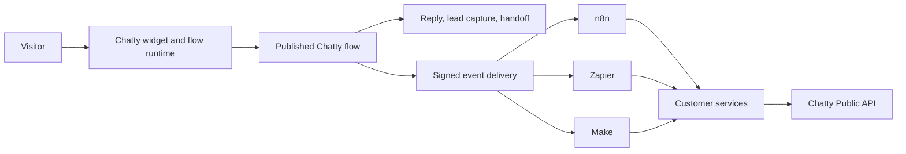

# Chatty flows and outbound automation integrations

This document defines the production flow model for Chatty.

Chatty is the source of truth for visitor conversations, leads, sessions, bookings, messages, and CSAT events.

n8n, Zapier, and Make are outbound automation destinations.

They are not native Chatty nodes.

## Product model

The Flow Builder has three responsibilities:

1. Build the Chatty conversation.
2. Validate and publish the Chatty flow.
3. Run Chatty-owned actions during a visitor session.

The external automation platforms have a different responsibility:

1. Receive signed Chatty events.
2. Transform or enrich event data.
3. Call an external service.
4. Call Chatty APIs when a write operation is required.

This boundary keeps the chat experience fast and keeps third-party credentials in the system that owns them.



## Where created flows appear

Open **Flow Builder** in the Chatty dashboard.

The My flows route is `/flow?bot_id={BOT_ID}`.

This route always opens **My flows**.

The editor route is `/flow/builder?bot_id={BOT_ID}&flow_id={FLOW_ID}`.

Use `/flow/builder?bot_id={BOT_ID}&new=1` to create a new flow.

My flows reads persisted records from `GET /api/flow-builder/flows`.

It does not display demo records.

It does not create a flow while loading the page.

Each saved flow card shows:

- name;
- draft or live status;
- latest version;
- node count;
- connection count;
- last update time;
- enable or pause control;
- editor link;
- delete control.

Select **New workflow** to open the separate editor route.

Select **Open editor** on a saved card to edit that flow.

The editor header has a **My flows** link.

## Chatty-first node palette

The palette contains only Chatty and protocol primitives:

| Node | Purpose |
| --- | --- |
| Chatty event | Start a flow from a Chatty event. |
| Reply in chat | Send a message to the visitor. |
| Webhook | Receive an HTTP event. |
| HTTP request | Call a customer-owned HTTPS endpoint. |
| Wait | Pause a flow. |
| Condition | Branch on Chatty data. |
| AI transform | Classify, extract, or summarize data. |

Provider nodes such as Google Sheets, Stripe, Slack, HubSpot, n8n, Zapier, and Make are not part of this palette.

Use an external platform when a provider-specific action is required.

Use the HTTP request node only when a direct, customer-owned endpoint is required.

## Event contract

Chatty sends a POST request to each active subscription that matches the event.

The JSON body has this shape:

```json
{
  "event": "lead.created",
  "bot_id": "00000000-0000-0000-0000-000000000000",
  "session_id": "session-id-if-available",
  "timestamp": "2026-10-03T12:00:00+00:00",
  "data": {
    "visitor_name": "Example visitor",
    "visitor_email": "visitor@example.com"
  }
}
```

Chatty sends `X-Chatty-Signature`.

The signature is an HMAC-SHA256 digest of the exact request body.

The signing secret is shown once when a webhook is created.

Store it in the destination platform's secret or credential store.

Do not put the secret in a flow message, URL, query string, or source repository.

### Supported event names

Chatty supports these event groups:

- `session.started`, `session.ended`, `session.assigned`, `session.resolved`, `session.transferred`;
- `message.user`, `message.assistant`, `message.agent`;
- `lead.created`, `lead.updated`, `lead.exported`;
- `meeting.booked`, `meeting.cancelled`, `meeting.rescheduled`;
- `sla.first_response_breached`, `sla.resolution_breached`;
- `csat.submitted`;
- `knowledge.source_added`, `knowledge.source_deleted`.

Subscribe only to the events required by the automation.

## Create a webhook subscription

### Chatty dashboard

1. Open **Developer API** in the Chatty dashboard.
2. Open the **Webhooks** section.
3. Select **Add webhook**.
4. Paste the destination webhook URL.
5. Select the event names.
6. Save the webhook.
7. Copy the signing secret to the destination platform.
8. Send a test event from the destination platform.

The dashboard endpoint is:

```text
POST /api/bots/{bot_id}/webhooks
```

The request body is:

```json
{
  "url": "https://destination.example/webhook",
  "events": ["lead.created", "message.user"]
}
```

The response contains the webhook ID, URL, events, active state, and secret.

Treat the secret as a password.

### Public API

API clients can create a subscription with `POST /api/v1/webhooks`.

Use a Chatty API key with the `write` scope.

Use `GET /api/v1/webhooks` to list subscriptions.

Use `DELETE /api/v1/webhooks/{webhook_id}` to remove a subscription.

The public API uses the bot attached to the API key.

## n8n setup

1. Create a new n8n workflow.
2. Add a **Webhook** trigger.
3. Use the production webhook URL from n8n.
4. Copy the URL into a Chatty webhook subscription.
5. Select Chatty events.
6. Activate the n8n workflow.
7. Send a Chatty test event.
8. Add n8n nodes for the external service.
9. Validate the `X-Chatty-Signature` header before processing sensitive data.

Use the n8n Webhook node in production mode.

Do not use the temporary test URL for a live Chatty subscription.

If n8n needs to update Chatty, use the Chatty Public API with a scoped API key.

## Zapier setup

1. Create a Zap.
2. Select **Webhooks by Zapier**.
3. Select **Catch Hook**.
4. Copy the generated hook URL.
5. Create a Chatty webhook subscription with that URL.
6. Select the required Chatty events.
7. Send a test event from Chatty.
8. Map fields from `event`, `bot_id`, `session_id`, and `data`.
9. Add the destination action.
10. Publish the Zap.

Use Zapier secret storage for any Chatty API key used by a later action.

Do not send Chatty API keys in event data.

## Make setup

1. Create a Make scenario.
2. Add **Webhooks** and select **Custom webhook**.
3. Create the webhook.
4. Copy the generated URL.
5. Create a Chatty webhook subscription with that URL.
6. Select the required Chatty events.
7. Run the Make webhook listener once.
8. Send a test event from Chatty.
9. Add filters, routers, and service actions.
10. Turn on the scenario.

Keep the Chatty signature header available to the scenario.

Add a filter before a side-effecting module when signature validation is required.

## Delivery and reliability

Chatty treats outbound automation as an asynchronous side effect.

A failing destination must not block a visitor reply.

Chatty uses a durable delivery queue for subscription webhooks.

Chatty retries a failed delivery with backoff.

The current schedule is 1 second, 5 seconds, 30 seconds, 5 minutes, 30 minutes, 2 hours, and 8 hours.

The delivery worker sends the initial request plus the scheduled retries.

Destination workflows must be idempotent.

Use a combination of `event`, `session_id`, `timestamp`, and a destination-side idempotency record.

Return a 2xx response after the event is accepted.

Do not perform a long-running operation before returning the response.

## Security requirements

- Use HTTPS endpoints.
- Validate the HMAC signature before processing PII.
- Reject old timestamps when the destination needs replay protection.
- Store the last processed event key.
- Use a Chatty API key with the smallest required scope.
- Rotate the destination webhook when a secret is exposed.
- Remove unused webhook subscriptions.
- Keep provider credentials in n8n, Zapier, or Make.
- Do not duplicate provider refresh-token storage in Chatty.

Chatty validates destination URLs and revalidates them during delivery.

Chatty blocks unsafe private network destinations.

## Publishing a Chatty flow

Saving a draft creates or updates a flow revision.

Publishing creates a published revision after validation.

The builder rejects a publish when:

- the graph has no nodes;
- the graph has no trigger;
- a required field is empty;
- an edge references a missing node;
- an edge creates a cycle;
- a Chatty reply has no message;
- an action endpoint is missing.

Publishing does not publish an n8n, Zapier, or Make workflow.

Publish each external workflow in its own platform.

## Operations checklist

Before production use:

1. Save the Chatty flow.
2. Test the Chatty flow.
3. Publish the Chatty flow.
4. Create the outbound webhook subscription.
5. Test signature validation.
6. Test one happy path.
7. Test one destination failure.
8. Confirm retry behavior.
9. Confirm duplicate-event handling.
10. Confirm that the external workflow is active.
11. Review the delivery log after the first live event.

Use the flow run history for Chatty execution.

Use the execution history in n8n, Zapier, or Make for external execution.

## Troubleshooting

### My flow is not listed

Save the flow first.

Refresh **My flows**.

Check that the selected bot ID is the bot used by the editor.

Check the browser session if the page reports an authentication error.

### The destination receives no event

Check that the webhook is active.

Check that the event name matches the subscription.

Check that the destination uses its production URL.

Check the destination execution history.

Check the Chatty webhook delivery log.

### Signature validation fails

Validate the exact raw request body.

Do not parse and re-serialize JSON before calculating the digest.

Use the secret from the webhook creation response.

Compare the hexadecimal HMAC-SHA256 digest with `X-Chatty-Signature`.

### A destination action runs twice

Treat webhook delivery as at-least-once.

Add an idempotency record in the destination workflow.

Use a stable event key for the record.

Do not rely on delivery order.
