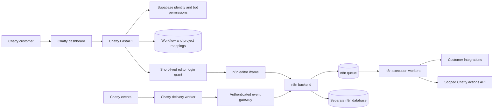

# n8n flow builder integration assessment

Date: 3 October 2026.
Chatty checkout: `4fe9640`.
Scope: Integrate n8n as a customer flow builder in Chatty.

## Decision

The integration is technically possible. Chatty already has the application services needed around n8n: Supabase authentication, per-bot permissions, billing, quotas, webhooks, and workers.

Use the n8n editor as an automation workspace for CRM, notifications, booking integrations, and post-call processing. Keep the chat and voice interaction loop in Chatty. A complete replacement of the conversational flow runtime needs additional state and UI adapters.

For customers to use the n8n editor inside Chatty, obtain the OEM agreement. Treat n8n as a separate service. Do not copy its editor into the React application as a component.

## Current repository state

The latest commit, `4fe9640`, removes the earlier n8n integration. Its parent, `6feef0e`, contains the prior implementation. This history supplies useful reference code, but it does not establish production readiness.

The removed code includes:

- `backend/app/routers/n8n.py`: status, workflow provisioning, and event trigger routes.
- `backend/app/services/n8n_service.py`: health checks, workflow lookup, starter templates, and webhook execution.
- `frontend/src/components/n8n-workflow-tab.tsx`: an editor iframe, test trigger, and fullscreen controls.
- `backend/voice-agent/custom-n8n/`: authentication overlay and custom Chatty nodes.
- Compose and reverse-proxy configuration, integration tests, and `docs/n8n-readiness.md`.

The prior readiness document explicitly says acceptance work remained. Its deployment and test claims describe that earlier checkpoint. I did not verify those claims against a live service.

The current dashboard has no n8n workflow tab. Old flow migrations and conversational widget code remain. `EmbedClient.tsx` still calls `/api/widget/flow/webhook`, but I found no matching route in the current backend Python source. The README and flow documentation therefore do not fully describe the current implementation. Check existing saved flows before any migration.

## Integration fit

| Chatty area | Existing code | Integration work |
| --- | --- | --- |
| Identity | `backend/app/core/deps.py` validates Supabase tokens | Map verified Chatty identities to n8n users. Establish a supported n8n session. |
| Permissions | `backend/app/core/permissions.py` checks bot ownership and member permissions | Define separate view, edit, publish, execute, and connection permissions. Map them to n8n scopes. |
| Dashboard | Next.js and React in `frontend/src/app/dashboard/` | Add an automation tab that embeds the separately hosted editor. |
| Bot boundary | Bots have an owner and per-bot team members | Map authorized users and bots to projects or instances. A personal project per user cannot represent all shared bots. |
| Events | `backend/plugins/notifications.py` has signed subscription deliveries | Forward approved events through a trusted gateway to the mapped workflow. |
| Durable delivery | `backend/app/workers/webhook_worker.py` and Redis Streams | Reuse durable dispatch. Keep it distinct from n8n's execution queue. |
| Product limits | `backend/app/services/chatty_quota_service.py` | Add workflow and execution allowances. Chat message quotas do not measure automation usage. |
| Product billing | Billing routes and dashboard tab exist | Add automation entitlements and reconcile n8n operating and licensing costs. |
| Customer API | `backend/app/routers/public_api.py` scopes operations to a bot API key | Use scoped Chatty actions from n8n. Add missing write actions where required. |
| Version history | Flow version and run migrations exist | Add explicit engine and execution mappings. The current graphs contain nodes and edges, not n8n connections. |

## Recommended design

Keep Supabase as the source of truth for Chatty identity, bots, teams, subscriptions, and customer data. Keep n8n workflow definitions and execution internals in n8n's own database. Store the mapping between them in Chatty.

Proposed mapping records include the tenant or workspace ID, bot ID, n8n instance ID, project ID, workflow ID, event bindings, and publication state. Store execution correlation records separately. Do not discover ownership by scanning workflow names or webhook paths.

A customer opens Automations for a bot. Chatty checks membership and feature access. The backend resolves the mapped n8n identity and resource boundary. It creates a short-lived editor login grant. The browser opens the authorized editor. Provisioning and publication are explicit operations with audited results.

For an event, Chatty selects the workflow from its trusted mapping. It sends a signed event with a stable event ID and bot context. A trusted gateway verifies the envelope before execution. An authenticated callback or scoped action records the result. Apply idempotency at dispatch and at external side effects.

## Authentication and isolation

The [official token exchange documentation](https://docs.n8n.io/deploy/host-n8n/deploy-as-an-oem-integration/set-up-token-exchange) describes iframe SSO and delegated API access. It requires Enterprise entitlement and a feature flag. It is currently a Preview feature. Pin the release and test the identity contract on each upgrade.

A suitable design is for Chatty to verify its normal Supabase session, then mint a short-lived asymmetric JWT for n8n with a restricted role and audience. Use the supported embed login flow. Test HTTPS, proxy headers, iframe policy, browser cookies, refresh, logout, and membership removal. Supabase login alone does not authorize access to an n8n project.

The previous integration placed a Supabase session token in the iframe URL and used a custom authentication overlay. Its provisioning service also switched to an instance API key when a user request returned 401. Replace these patterns with the supported login flow and explicit failure handling. An instance key is an administrative credential; it does not establish a customer resource boundary.

For shared infrastructure, define whether a project represents a customer workspace or an individual bot. A workspace project lets its members share resources. If two bots have different membership sets, a single project can grant access more broadly than Chatty intends. Use separate bot projects when their access policies must differ, subject to licensed quotas and roles. Verify that each project or instance operation matches the Chatty permission model.

Shared projects still share deployment administration, runtime capacity, and database infrastructure. Prefer separate customer instances where customers can author broad code or network operations and need stronger isolation. Separate hosting still requires the applicable commercial rights.

## Conversational flows need an adapter

Chatty's widget interprets question, choice, message, condition, and other nodes. It pauses for visitor input and renders widgets. Its saved flow schema uses `nodes` and `edges`.

n8n workflows use node parameters and source-indexed `connections`. An n8n webhook or wait operation does not automatically render a Chatty question, track a visitor response, or perform Chatty handoff behavior.

Use a hybrid design first:

1. Chatty handles the visitor conversation, session state, permissions, and UI.
2. Chatty invokes an n8n automation at a defined action boundary.
3. n8n returns a bounded result or uses a scoped Chatty action API.
4. Chatty resumes the conversation or delivers an asynchronous update.

If you want n8n to author the entire conversation, define custom Chatty nodes and a runtime contract for messages, questions, choices, handoff, booking, waiting, and resume. Persist conversation and execution correlation. Validate responses and enforce session ownership. Keep latency-sensitive voice processing in Chatty's voice runtime; start with post-call automations.

The removed custom action node mainly formats lead data, calculates duration fields, and formats responses. It does not supply a complete authenticated booking, inbox, or conversation integration. The previous starter templates also need real runtime validation. For example, their response expressions use `True`, while n8n expressions use JavaScript `true`.

## Credentials and publication

Customer OAuth connections in Chatty do not automatically become n8n credentials. Choose one owner for connection lifecycle. Either customers connect accounts through n8n, or n8n calls scoped Chatty actions that use Chatty-managed connections. Avoid maintaining two independent refresh-token implementations for the same connection.

Keep instance and Supabase service credentials out of customer workflows. Give custom Chatty nodes a dedicated credential type with bot or workspace scope. Test connection revocation and customer deletion.

Use n8n as the source of truth for native n8n workflow revisions. Keep Chatty binding records and deployment metadata. A draft save must not accidentally change the customer's live event mapping. Reconcile publication, deletion, transfer, and failed provisioning across the two systems.

Migrate old conversational graphs only after defining their semantics. Preserve original snapshots and provide rollback. Do not label converted n8n workflows as equivalent until replay checks confirm the behavior.

## Commercial requirements

The [OEM documentation](https://docs.n8n.io/deploy/host-n8n/deploy-as-an-oem-integration) requires a separate commercial agreement when customers use n8n's interface inside a product. It also requires n8n branding. Confirm the intended UI, branding, customer counts, project quotas, token exchange, and hosting model in that agreement.

Chatty's MIT license does not change n8n's license. Keep the n8n dependency and its license requirements explicit in self-hosting instructions. A download of the Community source does not grant OEM rights or unlock all required features.

## Implementation sequence

1. Confirm the OEM agreement, identity feature entitlement, and isolation model.
2. Deploy a pinned n8n release in a development environment with a separate database.
3. Add mapping tables and a backend adapter for explicit provisioning and lifecycle operations.
4. Add supported editor SSO and the dashboard automation tab.
5. Connect one existing event, such as `lead.created`, to a starter workflow.
6. Add a scoped Chatty action and test execution correlation and retry behavior.
7. Add publication controls, execution history, usage limits, and connection management.
8. Add conversation adapters only after the automation path works.
9. Validate migration, backups, upgrades, and customer cleanup before rollout.

## Acceptance checks

- Two unrelated customers cannot read, modify, execute, or use each other's workflows or credentials.
- Users with different bot memberships receive the correct editor and API access.
- Removing membership or logging out ends the intended access.
- Invalid login grants fail without switching to broader credentials.
- Duplicate events and callbacks produce one intended external action.
- A failed or unpublished workflow does not break the normal chat path.
- Events cannot select a different customer's workflow or bot action.
- Browser iframe login works under the supported domain and cookie configuration.
- Upgrade, backup restore, credential recovery, and customer deletion are verified.
- Concurrent load verifies queue wait, chat latency, voice latency, and usage enforcement.

## Assessment limits

I inspected the current Chatty source, the removed implementation in Git history, local n8n token exchange code, and current official documentation. I did not restore removed files, modify application behavior, run tests, deploy services, or verify existing hosted instances.

Conclusion: integration is feasible. Use a separate licensed n8n automation workspace with supported identity and explicit bot mappings. The previous implementation is a reference, not a release-ready base. Full conversational flow replacement is a larger project than embedding the editor.

## n8n node reuse decision

The `n8n-nodes-base` package can be installed as an npm package, but its nodes are runtime plugins. They expect n8n execution context, credentials, expressions, and lifecycle services. They are not portable browser node definitions.

Chatty should not bundle n8n's editor or runtime into the SaaS without an Embed or commercial license review. The safe implementation path is to define a provider-neutral Chatty node contract, then port selected integrations as Chatty adapters. A separate n8n deployment can remain an optional execution target through signed webhooks for customers who connect their own n8n instance.

The Chatty builder does not expose an `n8n workflow` node. Connect Chatty events to a customer-configured n8n Webhook trigger through the signed webhook subscription system. This connects to an external n8n workflow without embedding n8n's editor or runtime.
