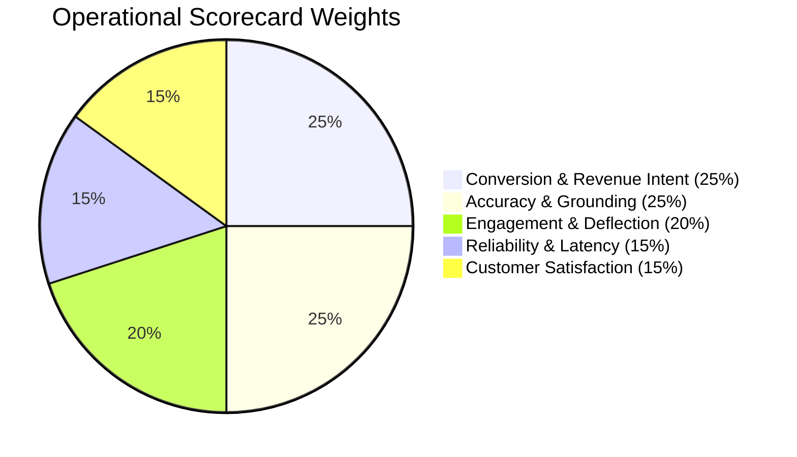

# 📊 Chatty Chatbot Performance Scorecard

> **Independent 5-Pillar Operational Assurance & Auditing for AI Chatbots**

Most AI evaluations measure raw model benchmarks: token speed, perplexity, or MMLU scores. They fail to answer the most crucial business question:

> **"Is your AI chatbot actually converting visitors and solving customer problems reliably?"**

The **Chatty Performance Scorecard** grades chatbots on an **A+ to F** scale across five core operational pillars, providing engineering, compliance, and marketing teams with a complete operational health assessment in under 60 seconds.

---

## 🏆 The Five Operational Pillars



### 1. 🎯 Conversion & Revenue Intent (Weight: 25%)
Measures how effectively the chatbot turns casual visitors into qualified prospects and pipeline revenue:
- **Lead Capture Rate**: Percentage of sessions that result in contact info capture (email/phone/name).
- **Meeting Booking Rate**: Conversions into scheduled calendar meetings (Google Calendar, Outlook 365, Zoom).
- **Proactive Campaign CTR**: Click-through and engagement rates on exit-intent and time-on-page triggers.
- *Benchmark Target:* $\ge 15\%$ session-to-lead conversion.

### 2. 💬 Engagement & Autonomous Deflection (Weight: 20%)
Measures self-service resolution efficiency without overwhelming human support staff:
- **Deflection Rate**: Conversations fully resolved without human intervention or ticket creation.
- **Turn Depth**: Average user interactions per session (optimal sweet spot is 3–8 turns).
- **Ticket Escalation Rate**: Inverse metric tracking how often a bot fails over to live human agents.
- *Benchmark Target:* $\ge 85\%$ autonomous resolution rate.

### 3. 🧠 Accuracy & Knowledge Grounding (Weight: 25%)
Measures adherence to business facts and defense against hallucinated promises:
- **RAG Retrieval Precision**: Semantic relevance of retrieved documentation chunks.
- **Anti-Hallucination Guardrails**: Scans preventing the model from claiming an action (e.g., booking confirmation) without executing the respective tool.
- **Tool-Calling Success**: Ratio of valid, successful tool invocations (checking slots, creating tickets).
- *Benchmark Target:* $\ge 98\%$ factual execution consistency.

### 4. ⚡ Reliability & Responsiveness (Weight: 15%)
Measures infrastructure responsiveness and system resilience:
- **p95 First-Response Latency**: Time to first token stream.
- **Error Budget**: Percentage of AI inference calls resulting in API error or provider timeout.
- **Fallback Chain Resilience**: Seamless transitions between primary models and backup providers (e.g. Gemini $\to$ Flash-Lite $\to$ BYOK).
- *Benchmark Target:* $\text{p95} < 1,500\text{ms}$ for chat, $< 500\text{ms}$ for voice.

### 5. 😊 Customer Satisfaction & Sentiment (Weight: 15%)
Measures end-user sentiment and post-chat feedback:
- **Average CSAT**: 1 to 5 star rating submitted through widget post-chat prompt.
- **Positive Sentiment Ratio**: Percentage of 4-star and 5-star responses.
- **Sentiment Shift**: Transition in user tone between conversation start and resolution.
- *Benchmark Target:* $\ge 4.5/5.0$ CSAT score.

---

## 📈 Letter Grade Scale

| Grade | Composite Score | Operational Status | Interpretation |
|---|---|---|---|
| **A+** | 93 – 100% | **Exceptional** | World-class conversion and autonomous resolution. Ready for high-volume scale. |
| **A** | 90 – 92.9% | **Excellent** | Strong lead generation, low hallucination risk, high customer satisfaction. |
| **A-** | 87 – 89.9% | **Very Good** | Solid business metrics with minor optimization opportunities in edge cases. |
| **B+** | 83 – 86.9% | **Good** | Reliable everyday performance; review unhandled queries to boost deflection. |
| **B** | 80 – 82.9% | **Competent** | Functional customer support bot; needs proactive campaign tuning. |
| **B-** | 75 – 79.9% | **Fair** | Meeting basic deflection goals but losing potential leads or bookings. |
| **C+** | 70 – 74.9% | **Needs Attention** | Elevated human escalation rate or noticeable latency bottlenecks. |
| **C** | 65 – 69.9% | **Sub-optimal** | Frequently misses customer intent; knowledge base requires restructuring. |
| **D** | 55 – 64.9% | **Poor** | High error rates or lack of relevant knowledge documents. |
| **F** | $< 55\%$ | **Failing** | Critical misconfiguration; bot is causing customer friction. |

---

## 🛠️ Three Ways to Audit Your Chatbot

### 1. Terminal CLI (Instant Evaluation)
Run the built-in auditor script to print an ANSI scorecard:

```bash
# Test with synthetic baseline benchmark:
python scripts/audit_bot.py --sample

# Audit your live bot instance:
python scripts/audit_bot.py --bot-id <YOUR_BOT_UUID> --days 30

# Export markdown report to file:
python scripts/audit_bot.py --bot-id <YOUR_BOT_UUID> --format markdown --output audit-report.md
```

### 2. Dashboard REST API
Integrate scorecard reporting into internal dashboards or CI/CD pipelines:

```http
GET /api/admin/analytics/scorecard?bot_id=YOUR_BOT_ID&days=30
Authorization: Bearer <SUPABASE_JWT_OR_API_KEY>
```

#### Sample Response:
```json
{
  "bot_id": "8f9024b1-e25c-4122-8d77-a82a6fce921b",
  "period_days": 30,
  "overall_grade": "A-",
  "composite_score": 88.5,
  "status": "High Performing",
  "audit_timestamp": "2026-09-29T14:38:39Z",
  "pillars": {
    "conversion": { "score": 86.4, "weight": "25%" },
    "engagement": { "score": 91.2, "weight": "20%" },
    "accuracy": { "score": 93.0, "weight": "25%" },
    "reliability": { "score": 85.0, "weight": "15%" },
    "satisfaction": { "score": 86.8, "weight": "15%" }
  },
  "recommendations": [
    "Enable exit-intent campaign triggers to recover abandoning cart visitors.",
    "Add FAQ chunks for international returns to reduce the remaining 8.8% escalations."
  ]
}
```

### 3. Model Context Protocol (MCP) Inside Claude or Cursor
Ask your AI coding assistant:

> *"Run an audit on my bot `8f9024b1-e25c-4122-8d77-a82a6fce921b` and explain the scorecard."*

The MCP client invokes the `get_bot_performance_scorecard` tool or accesses the live resource `chatty://bots/{bot_id}/scorecard` to diagnose blind spots.

---

## 🚀 Optimization Playbook

| Symptom / Low Pillar | Recommended Action in Chatty |
|---|---|
| **Low Conversion (< 80%)** | 1. Go to **Flows** and insert a **Lead Capture Form** node early in high-intent paths.<br>2. Enable **Exit-Intent Campaigns** in the Campaigns tab.<br>3. Connect Google/Outlook Calendar in **Integrations** for 1-click meeting bookings. |
| **Low Deflection (< 80%)** | 1. Check **Inbox → Unanswered Queries** to see what visitors ask.<br>2. Upload missing PDFs or re-crawl your website in **Knowledge**.<br>3. Lower temperature in **Settings** (0.2–0.4) for stricter adherence. |
| **High Latency (> 2,000ms)** | 1. Switch default model to `gemini-2.5-flash-lite` in **Settings**.<br>2. Configure Upstash Redis rate limiting / caching in `backend/.env`.<br>3. Enable streaming SSE on all widget embeds. |
| **Low CSAT (< 4.2/5)** | 1. In **Customizer**, tune tone to be empathetic and concise.<br>2. Set up Slack/Email escalation alerts in **Notifications** so human agents take over before customers get frustrated. |
