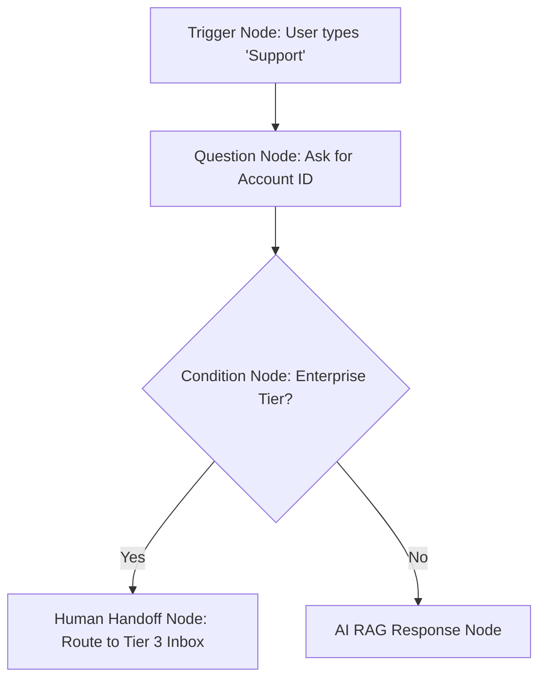

# Visual Flow Architect & AI Copilot

The **Visual Flow Architect** allows teams to build complex, branching conversation workflows, qualification quizzes, and deterministic interactive menus using a modern node canvas.

---

## Canvas Node Types

- **Trigger Nodes**: Activates a flow when a visitor opens the widget, matches a regex, or clicks a specific starter button.
- **Message Nodes**: Sends formatted text, images, videos, or quick-reply chips.
- **Question Nodes**: Prompts visitor for data with validation rules (e.g. valid email, phone number, numeric range).
- **Condition Nodes**: Branches logic based on visitor variables, geolocation, or previous answers.
- **Tool Execution Nodes**: Triggers calendar bookings, external webhooks, or CRM lead capture.
- **Human Handoff Nodes**: Suspends AI and routes the session to human agent queues.
- **End Nodes**: Gracefully closes the conversation branch and requests CSAT feedback.

---

## Natural Language AI Copilot

Instead of manually dragging dozens of nodes, you can generate complete flows by describing them in plain language:

> *"Build a customer onboarding flow that asks for their company size. If under 10 employees, recommend our Starter plan. If over 50, prompt for their email and offer to book a demo call."*

The Copilot generates nodes, sets up condition branches, connects edges, and lays out the entire diagram instantly.
