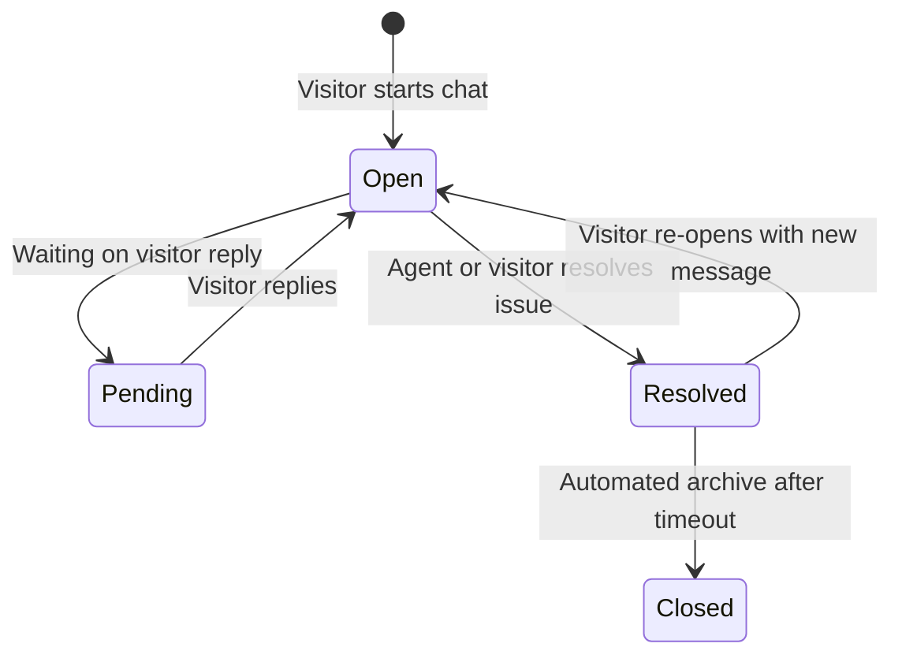

# Omnichannel Live Inbox & Helpdesk

Chatty's **Inbox** transforms conversational AI into an enterprise-ready human-in-the-loop support desk. When an AI bot encounters a complex question, a visitor requests a human agent, or a lead signals high intent, the ticket seamlessly routes to human operators.

---

## Key Capabilities

<CardGroup cols={2}>
  <Card title="Live Agent Takeover" icon="user-headset" color="#f97316">
    Pause AI generation instantly when an agent joins a ticket to prevent conflicting or overlapping answers.
  </Card>
  <Card title="Dual SLA Tracking Engine" icon="clock" color="#f97316">
    Monitor both **First Response SLA** and **Resolution SLA** with real-time dynamic countdown timers and breach alerts.
  </Card>
  <Card title="Round-Robin Auto-Dispatch" icon="bolt" color="#f97316">
    Automatically distribute unassigned queue tickets to online team members based on capacity and current load.
  </Card>
  <Card title="Agent Presence Roster" icon="users" color="#f97316">
    Track who is `online`, `busy`, `away`, or `offline` and monitor active ticket loads in real time.
  </Card>
</CardGroup>

---

## Ticket Lifecycle & Statuses

Tickets transition through four well-defined states:

| Status | Description | SLA Impact |
| :--- | :--- | :--- |
| **Open** | Active conversation requiring attention from either AI or an assigned agent. | SLA clocks actively count down. |
| **Pending** | Awaiting input from the visitor or external escalation. | First Response SLA stops; Resolution SLA tracks. |
| **Resolved** | The visitor's inquiry has been answered. | Both First Response and Resolution SLAs are marked `met`. |
| **Closed** | Final archived state. | Inactive. |

---

## SLA Calculation Engine

Chatty provides granular SLA monitoring for enterprise support teams:

1. **First Response SLA**: Measures time elapsed between the visitor's first message and the agent's first reply (e.g. 15-minute goal).
2. **Resolution SLA**: Measures total duration from ticket inception to resolution (e.g. 4-hour goal).

### Visual SLA Badges

The UI displays reactive status pills:
- `⏱️ 12m left`: Ticket is well within SLA targets.
- `⚠️ 4m left (Resp)`: First Response SLA is nearing deadline.
- `🚨 Breached 15m ago`: SLA target was breached; ticket is flagged urgent.
- `✅ SLA Met`: Response or resolution met before the deadline.

---

## Presence & Automatic Dispatch

### Agent Presence States
- **Online**: Available to receive incoming live tickets.
- **Busy**: Currently at capacity or focusing on an urgent case.
- **Away**: Temporarily stepped away.
- **Offline**: Signed out.

### Dispatching from the Queue
When tickets accumulate in the unassigned **Queue**, administrators or automated cron jobs trigger `/api/admin/routing/dispatch-queue`. The routing engine:
1. Gathers all unassigned tickets ordered by `last_message_at`.
2. Queries agents marked `online`.
3. Dispatches tickets to the agent with the lowest active load who is under their `max_capacity`.
4. Automatically pauses the AI (`ai_paused = True`) so the human agent takes ownership immediately.
