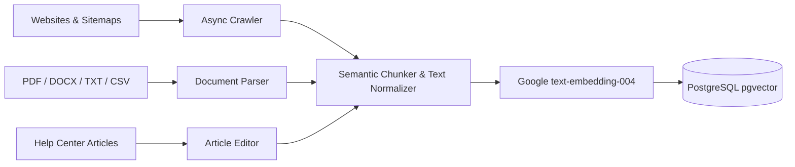

# Enterprise Knowledge Base & Help Center

Chatty combines an automated multi-source ingestion engine with a public-facing documentation portal (`/kb/[botId]`), ensuring your AI assistant and human customers have access to accurate, up-to-date information.

---

## Multi-Source Ingestion Pipeline



### Ingestion Methods

1. **Website & Sitemap Crawling**:
   - Provide any URL or `sitemap.xml`.
   - The crawler traverses links, cleans boilerplate navigation elements, footers, and scripts, and ingests pure markdown text.
   - Schedule automated crawls **Daily** or **Weekly** to maintain freshness.
2. **File Uploads**:
   - Upload PDF manuals, Word documents, text files, and CSV tabular datasets.
   - Files are parsed, divided into semantic chunks, and embedded instantly.
3. **Q&A Pairs**:
   - Explicit question-and-answer pairs override general context for strict policy questions.

---

## Public Help Center Portal (`/kb/[botId]`)

Every Chatty bot automatically gets a customizable, SEO-optimized public Help Center portal accessible at:
```
https://chatty.personaliai.com/kb/<bot_id>
```

### Key Portal Features
- **Hierarchical Collections**: Group articles by category (e.g. *Getting Started*, *Billing*, *Security*).
- **Instant Search**: Full-text and semantic search bar with autocomplete suggestions.
- **Rich Markdown & Math**: Supports LaTeX equations (`KaTeX`), syntax-highlighted code blocks, tables, and callouts.
- **Customer Feedback Loop**: Visitors can vote thumbs up or thumbs down (*"Was this article helpful?"*) to measure documentation quality.
