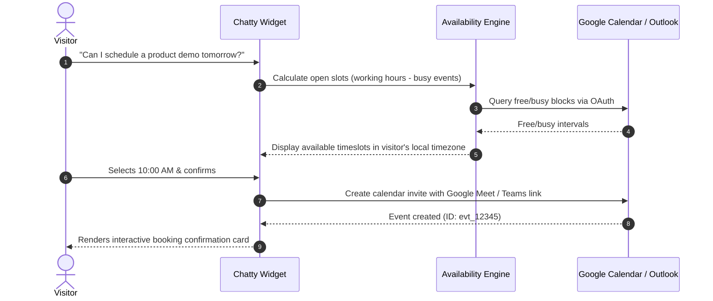

# Intelligent Calendar & Meeting Booking

Chatty includes a native booking engine that turns conversational intent into confirmed calendar appointments without leaving the chat window.

---

## Architecture & Integration Flow

---

## Core Capabilities

### 1. Multi-Provider OAuth2 Sync
Connect team calendars seamlessly via Google Calendar, Microsoft Outlook 365, or Cal.com. Events are created directly on the host's primary calendar with automatic video conference links (Google Meet, Microsoft Teams, or Zoom).

### 2. Round-Robin Load Balancing
Incoming appointments can be distributed evenly across bookable team members, preventing calendar overload and ensuring rapid lead response times.

### 3. Automatic Timezone Conversion
The widget detects the visitor's local timezone using browser heuristics and geolocation IP, presenting timeslots in their native time (e.g. converting a host's EST availability into JST for a visitor in Tokyo).

### 4. Smart Auto-Fill
If the visitor provided their name, email, or company during earlier chat messages, the booking card automatically pre-fills these fields so the user can confirm with a single click.

### 5. Anti-Fake Meeting Defense
Protects team schedules by verifying email MX records, filtering throwaway domains, and applying rate limits per IP address.
