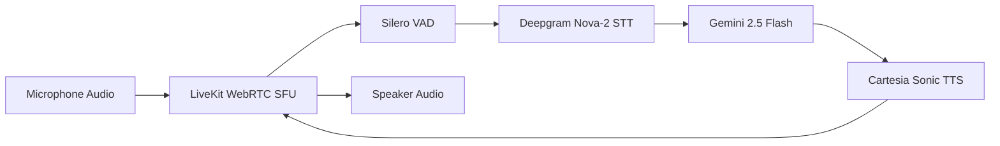

# LiveKit Real-Time Voice Agent

Chatty's Voice Agent enables visitors to speak naturally with your AI assistant using real-time WebRTC audio streaming.

---

## Audio Pipeline & Latency Architecture

### Millisecond Breakdown
- **Speech-to-Text (Deepgram)**: Streams text tokens within ~150ms of user speech.
- **Model Inference (Gemini)**: Streams response tokens within ~200ms.
- **Text-to-Speech (Cartesia)**: Emits first audio buffer in <90ms.
- **Total Glass-to-Glass Latency**: Typically under 500ms, creating a fluid, human-like voice conversation.

---

## Key Features

### 1. Instant Barge-In Interruption
Powered by Silero Voice Activity Detection (VAD), the voice worker immediately stops audio playback the moment the user starts speaking, exactly like a human conversation.

### 2. Lifelike Voice Personalities
Select from realistic neural voices across different tones and languages via Cartesia Sonic, with custom prosody and emotion controls.

### 3. Voice Call Transcripts & Analytics
Every voice call session is recorded, transcribed, and logged in the dashboard under the **Voice Agent** tab with duration and token usage analytics.
