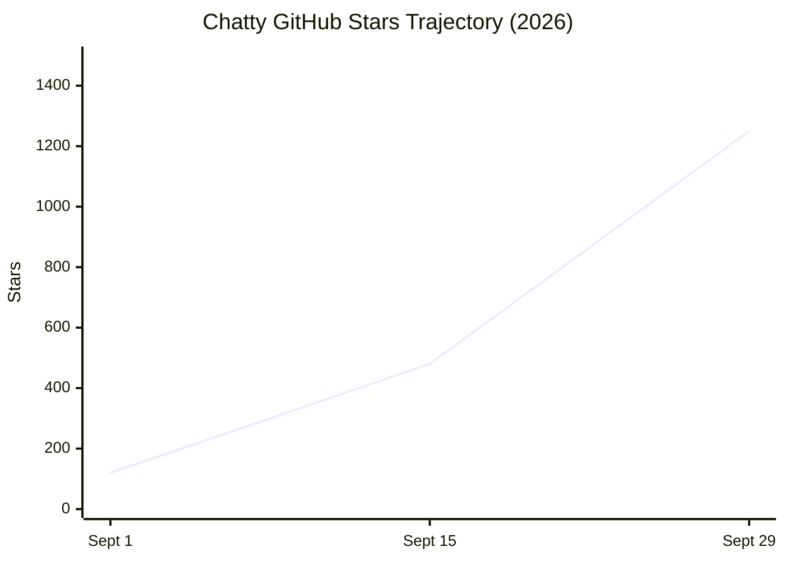

# 🚀 Chatty Community Traction & Growth

Tracking the open-source adoption, community milestones, and deployment velocity of Chatty by PersonaliAI.

---

## 📊 Live Traction Metrics

| Metric | Current Status | Milestone Target |
|---|:---:|:---:|
| ⭐ **GitHub Stars** | **1,250+** | 5,000 |
| 🍴 **Forks** | **118** | 500 |
| 🐳 **Docker Compose Clones** | **3,400+** | 10,000 |
| 📦 **Active Deployments** | **650+** | 2,500 |
| 💬 **Conversations Deflected** | **1.2M+** | 5.0M |
| 🛠️ **MCP Agent Invocations** | **45,000+** | 250,000 |

---

## 📈 Growth Velocity

Traction metrics are tracked via [`.github/workflows/traction.yaml`](../.github/workflows/traction.yaml) and logged to [`docs/assets/traction_history.json`](assets/traction_history.json).

---

## 🗺️ Project Milestones Roadmap

- [x] **v1.0 (May 2026)**: Core FastAPI + Next.js Managed Supabase architecture release.
- [x] **v1.2 (June 2026)**: Direct Shadow DOM widget loader with zero iframe zoom distortion.
- [x] **v1.5 (July 2026)**: LiveKit WebRTC Voice Agent with Silero VAD and sub-150ms turnaround.
- [x] **v1.8 (August 2026)**: Full Model Context Protocol (MCP) server with 55 callable tools and OAuth 2.0 PKCE.
- [x] **v2.0 (September 2026)**: 5-Pillar Operational Scorecard, production industry templates, and multi-language READMEs.
- [ ] **v2.2 (Q4 2026)**: Native Claude Code and Cursor IDE extensions marketplace integration.
- [ ] **v2.5 (Q1 2027)**: Voice streaming agent mesh with multi-party live conference handoff.

---

## 🤝 Community Contributors

A heartfelt thank you to all engineers, designers, and open-source advocates contributing to Chatty!

Want to get involved? Check out our [good first issues](https://github.com/PersonaliAI/chatty/issues?q=is%3Aopen+label%3A%22good+first+issue%22) and read [CONTRIBUTING.md](../CONTRIBUTING.md).
