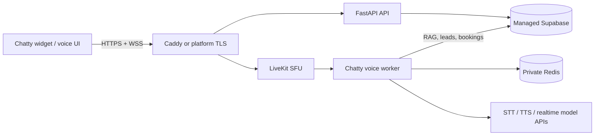

# Voice worker self-hosting

This guide runs the voice worker on your infrastructure while keeping the
existing Supabase project (Auth, Postgres, Storage and Realtime) unchanged.
The worker supports both pipeline voice (STT → RAG/LLM → TTS) and realtime
speech-to-speech providers. Multimodal catalog RAG can return spoken answers
plus product images/video cards in the same voice UI.

## 1. Architecture and boundaries



Only LiveKit and the worker are required on a VPS. Do not deploy a second
database or storage stack when using the current Supabase setup. Redis is
required only by a self-hosted LiveKit server; it is not exposed publicly.

## 2. Prerequisites and secrets

Use Ubuntu 22.04/24.04, Docker Engine and Compose v2. Create a dedicated
DNS name such as `livekit.example.com` pointing to the host. Copy
`backend/voice-agent/.env.example` to `.env`, set file permissions to `600`,
and provide:

| Variable | Purpose |
| --- | --- |
| `SUPABASE_URL`, `SUPABASE_SECRET_KEY` | Existing managed Supabase project |
| `GEMINI_API_KEY` | Shared Chatty brain and embeddings |
| `LIVEKIT_API_KEY`, `LIVEKIT_API_SECRET` | Worker/SDK authentication |
| `LIVEKIT_URL` | `wss://...` public LiveKit endpoint |
| `LIVEKIT_WORKER_URL` | `ws://livekit:7880` only with the self-hosted Compose profile |
| `BYOK_ENCRYPTION_KEY` | Decrypts tenant provider keys; never commit it |
| provider keys | Optional server-side fallbacks (`OPENAI_API_KEY`, `DEEPGRAM_API_KEY`, `CARTESIA_API_KEY`, `ELEVENLABS_API_KEY`, `FISH_API_KEY`, `SONIOX_API_KEY`, `ASSEMBLYAI_API_KEY`) |

Apply all versioned Supabase migrations before enabling production voice,
including `20260829040000_chatty_voice_calls.sql`,
`20260916120000_multimodal_rag.sql`, and
`20260924130000_voice_observability.sql`.

## 3. One-host Docker deployment (recommended for Contabo/VPS)

1. Install Docker and clone the repository on the host.

   ```bash
   sudo mkdir -p /opt/chatty && sudo chown "$USER" /opt/chatty
   git clone --recurse-submodules https://github.com/PersonaliAI/chatty.git /opt/chatty
   cd /opt/chatty/backend/voice-agent
   cp .env.example .env
   chmod 600 .env
   ```

2. For LiveKit Cloud, set `LIVEKIT_URL` to the Cloud WSS URL, leave
   `LIVEKIT_WORKER_URL` empty, and start only the worker:

   ```bash
   docker compose up -d --build voice-worker
   docker compose logs -f --tail=100 voice-worker
   ```

3. For a fully self-hosted media plane, set `DOMAIN` and `LIVEKIT_HOST` to
   the public IPv4 address, then run the supplied setup script:

   ```bash
   ./setup.sh
   docker compose --profile self-hosted up -d --build
   docker compose ps
   ```

   Open TCP `80`, `443`, `7881` and UDP `3478`, `7882`, and
   `50000-60000` in the VPS firewall. Keep Redis bound to loopback/private
   networking. LiveKit requires a publicly trusted TLS certificate; Caddy
   obtains it automatically once DNS resolves.

4. Verify health and registration:

   ```bash
   curl -fsS http://127.0.0.1:8081/ || true
   docker compose logs --tail=200 voice-worker livekit
   ```

5. In the Chatty dashboard enable Voice Agent and run **Test connection**.
   The browser must receive a short-lived token from
   `POST /api/widget/voice/token`; the browser never receives LiveKit API
   secrets.

## 4. Railway

Railway maps each Compose service to a separate service rather than running a
Compose file directly. Create three services from the repository: `api` using
`backend/Dockerfile`, `frontend` using the Next.js app, and `voice-worker`
using `backend/voice-agent/Dockerfile`. Add the variables above in Railway's
Variables tab (shared variables are useful for Supabase and model keys).

1. Deploy the API and generate its HTTPS domain.
2. Deploy the frontend and set its backend URL to the API domain.
3. Set the worker start command to `python voice-agent/voice_worker.py start`.
4. Use Railway Redis or another managed Redis for a self-hosted LiveKit
   server; do not expose Redis publicly.
5. Prefer LiveKit Cloud on Railway. Railway services are excellent for HTTP
   API/worker containers, but a dedicated VPS is the safer choice for LiveKit's
   UDP port range and public-IP/host-network requirements.

Railway variables are staged and must be deployed after edits. Volumes are
runtime-only; never depend on a build-time filesystem for uploads.

## 5. Render

Create a Render **Web Service** for the API, a second Web Service or Static
Site for the frontend, and a **Background Worker** for the voice worker. Use
Docker runtime for all three and set the API health check to `/`.

1. Point each service at the same branch and set its Dockerfile path/root.
2. Add Supabase, LiveKit and model secrets in the service Environment tab.
3. Set the worker command to `python voice-agent/voice_worker.py start`.
4. Use Render Key Value (Redis-compatible) only for a managed LiveKit setup;
   for a self-hosted LiveKit media server use the VPS procedure instead.
5. Set a paid worker plan for production calls, configure graceful shutdown,
   and inspect worker logs after every deploy.

Render workers do not receive inbound HTTP traffic, so the API token endpoint
must stay on the Web Service. Persistent disks are not required because
Supabase owns application data.

## 6. Heroku-style platforms

Heroku can run the API as a `web` process and the voice worker as a `worker`
process from the same container image or separate Dockerfiles:

```yaml
# heroku.yml
build:
  docker:
    web: backend/Dockerfile
    worker: backend/voice-agent/Dockerfile
run:
  web: uvicorn app.main:app --host 0.0.0.0 --port $PORT
  worker: python voice-agent/voice_worker.py start
```

Set config vars with `heroku config:set`, push/release both process types,
and scale at least one web and one worker dyno. Heroku's filesystem is
ephemeral and its container runtime is HTTP-only; use LiveKit Cloud (or a
separate VPS) for the LiveKit SFU rather than trying to expose the WebRTC UDP
range from a dyno.

## 7. API and frontend from source

For an independent API/frontend deployment, build the existing images rather
than copying source into a second project:

```bash
docker build -f backend/Dockerfile -t chatty-api .
docker build -f frontend/Dockerfile -t chatty-frontend .
docker build -f backend/voice-agent/Dockerfile -t chatty-voice-worker backend
```

The API must listen on `0.0.0.0:$PORT`; the frontend needs
`NEXT_PUBLIC_API_URL` and the public widget origin. Run migrations as a
one-time release step, never on every request. Put TLS, rate limiting and
security headers at the platform edge.

## 8. Observability and troubleshooting

The dashboard's **Voice agent health** panel reads aggregated rows from
`/api/admin/analytics/voice`: calls, first-response latency (average/p95),
peak RSS memory, process CPU, turns, re-engagement nudges, errors and voice
cost. No raw audio is stored by this telemetry.

- `502 /api/widget/voice/token`: check API logs, `LIVEKIT_URL`, LiveKit keys,
  bot voice entitlement and the worker registration logs.
- No audio or transcription: verify browser microphone permission, WSS TLS,
  LiveKit UDP/TCP firewall rules, and that the worker is connected to the same
  LiveKit project.
- Product cards missing: verify the multimodal migration/RPC, catalog rows,
  and that the voice tool can reach Supabase; the spoken answer still works
  when no catalog match exists.
- High latency: keep worker and LiveKit in the same region, use a compute
  optimized VPS, keep warm worker processes, and inspect p95 telemetry.

## 9. Security checklist

- Use trusted TLS certificates and WSS; never use `ws://` for browser traffic.
- Keep Supabase service keys, LiveKit secrets and BYOK encryption keys in a
  secret manager or ignored `600`-permission file.
- Restrict Redis to private/loopback networking and firewall all unused ports.
- Run containers with restart policies, bounded call duration and log rotation.
- Rotate keys, apply migrations before deploy, back up Supabase, and test a
  restore before scaling out.
- Do not store raw microphone audio by default; retain transcripts only under
  the tenant's configured privacy policy.

## Official deployment references

- [LiveKit deployment and TLS](https://docs.livekit.io/transport/self-hosting/deployment/)
- [LiveKit firewall ports](https://docs.livekit.io/transport/self-hosting/ports-firewall/)
- [Railway Compose mapping](https://docs.railway.com/guides/docker-compose)
- [Railway variables](https://docs.railway.com/variables)
- [Render web services](https://render.com/docs/web-services)
- [Render background workers](https://render.com/docs/background-workers)
- [Heroku Docker/container runtime](https://devcenter.heroku.com/articles/container-registry-and-runtime)
